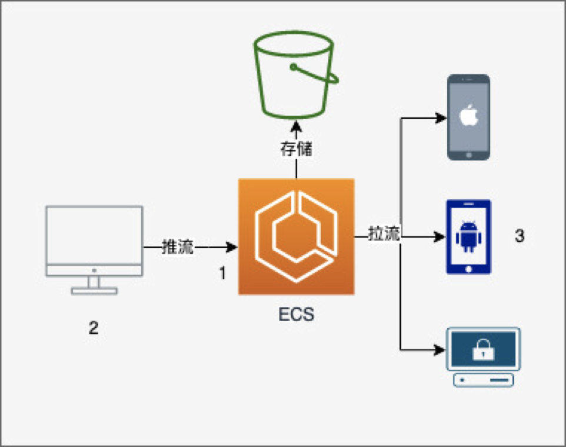
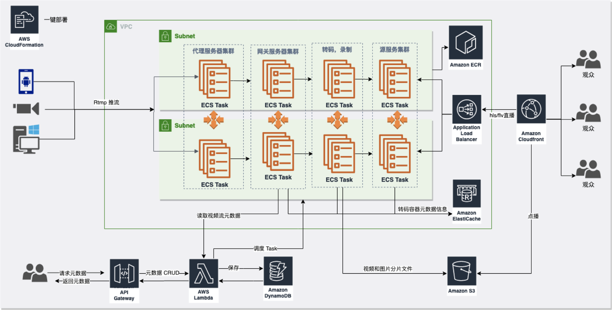
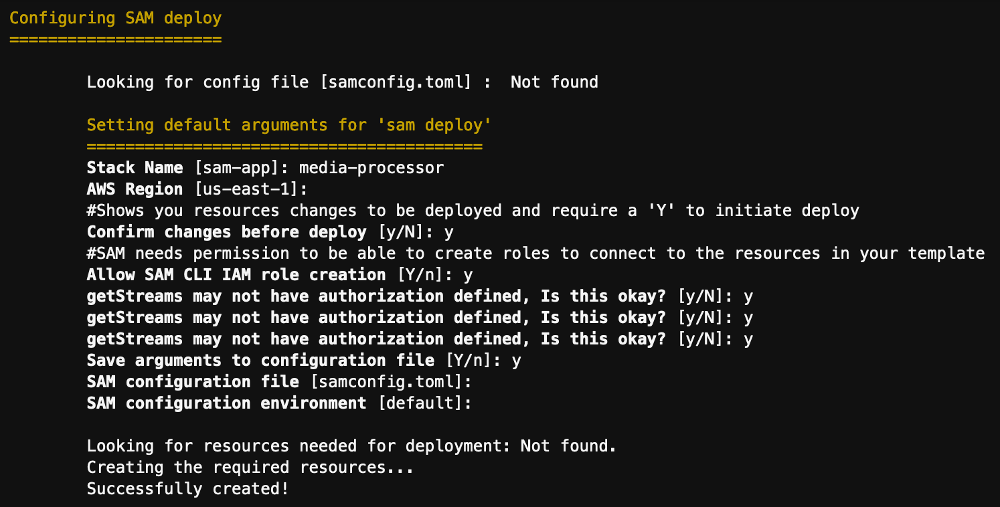
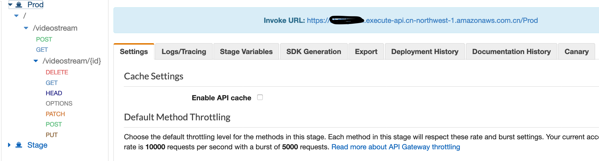
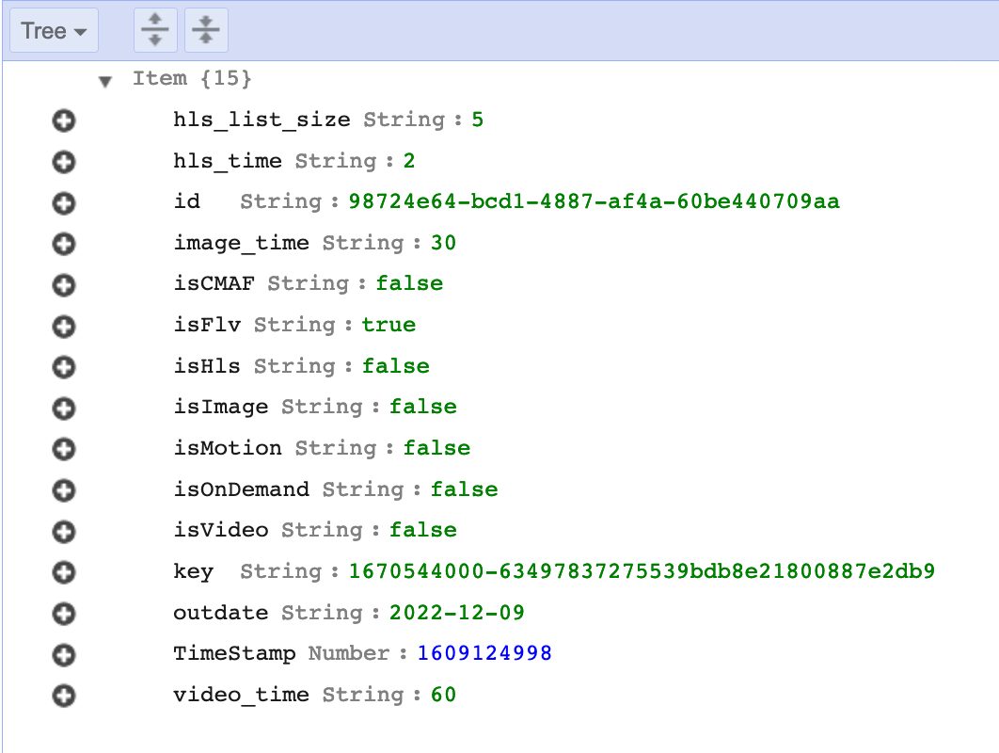
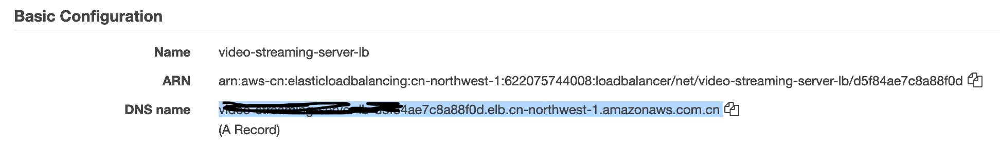
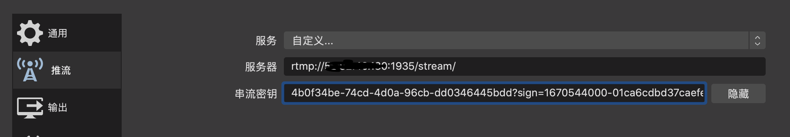
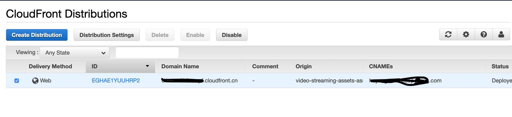
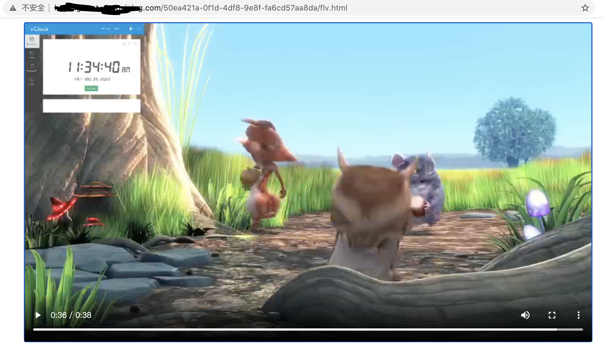

## AWS  Video Stream Solution

The solution is a highly available, resilient, end-to-end video streaming live, cloud storage, and on-demand solution based on AWS ECS.



#### Feature ：

**Live streaming:** Support mainstream RTMP protocol streaming. Supports common third-party streaming software such as OBS/XSplit/FMLE, common third-party RTMP streaming hardware and devices such as encoders or boxes;

**Live playback:** Support HTTP-FLV(2 seconds latency) and HLS\CMAF( Greater than 10 second delay) three playback protocols. Support common third party FLV, RTMP, HLS player VLC,FFPLAY;

**Video processing:** live broadcast transcoding, live broadcast recording, live broadcast screenshot, video movement detection, etc.

**Video storage and VOD**:video storage, support recording HLS chip storage, voD

**management console:** provide API management and graphical management;

**Live streaming security:** Supports URL authentication of push stream

### Architecture:




## Installation

**Prerequisites:**

Please note that this project has only been tested on macOS. Windows  users may need to update some of the scripts. Pull requests are welcome  to add Windows support.

1. Install and configure the AWS Command Line Interface，please configure your `output` format to be `json`. [Instructions](https://docs.aws.amazon.com/cli/latest/userguide/cli-usage-output.html)

   ```
   sudo pip install --upgrade awscli && hash -r
   ```

2. Install [jq](https://stedolan.github.io/jq/) to process command-line JSON.

   ```
   sudo yum -y install jq gettext bash-completion moreutils
   ```

3. Install [sam](https://docs.aws.amazon.com/serverless-application-model/latest/developerguide/serverless-sam-cli-install.html) cli to build serverless application on aws

4. Clone the repository

   ```bash
   $ git clone https://github.com/superyhee/media-processor.git
   ```

5. Deploy the backend

   ```bash
   $ cd stacks
   $./setup.sh
   ```

6. Deploy Managment API

   ```bash
   $ cd metadata
   $ sam build
   $ sam deploy --guided
   
   ```

------



## Application Walkthrough

1. Create video stream metadata

   - Get  API Gateway invoke URL

     

   - Post video stream metadata by curl

     ```bash
     curl -d '{"isFlv":"true", "isHls":"false","isVideo":"false", "isImage":"false","isMotion":"false", "isOnDemand":"false","isCMAF":"false","video_time":"60","image_time":"30","hls_time":"2","hls_list_size":"5", "outdate":"2022-12-09"}' -H "Content-Type: application/json" -X POST https://xxxxx.execute-api.cn-northwest-1.amazonaws.com.cn/Prod/videostream
     ```

   - Get your stream id and signed key from Dynamodb console

     

   

2. Get push  stream URL:

   - Get push stream address from ELB console

     

   - For example:

     you can get your push url with following:

     ```bash
     rtmp://NLB_DomainName/stream/98724e64-bcd1-4887-af4a-60be440709aa?sign=1670544000-63497837275539bdb8e21800887e2db9
     ```

     then you can use OBS to push video stream

     

     **Encoder** ： x264

     **Rate Control** ：CBR

     **Bitrate** ： 1000 (or lower)

     **Keyframe Interval** (seconds, 0=auto) ：2

     **CPU Usage Preset** (higher = less CPU) ：veryfast, 
     **Tune** ： zerolatency


3. pull stream

   - Get pull stream url from cloudfront console

     

   - View video by video player(ffplayer) or brower

     ffplay:

     ```
     ffplay http://cloudfront_dns/98724e64-bcd1-4887-af4a-60be440709aa/live.flv
     ```

     brower:

     ```
     http://cloudfront_dns/98724e64-bcd1-4887-af4a-60be440709aa/flv.html
     ```

     

